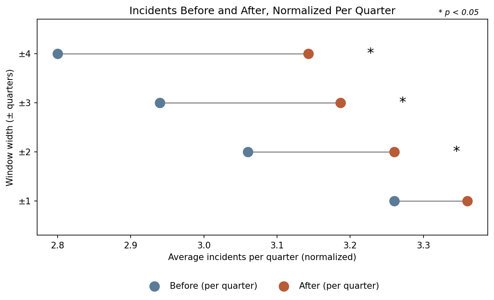
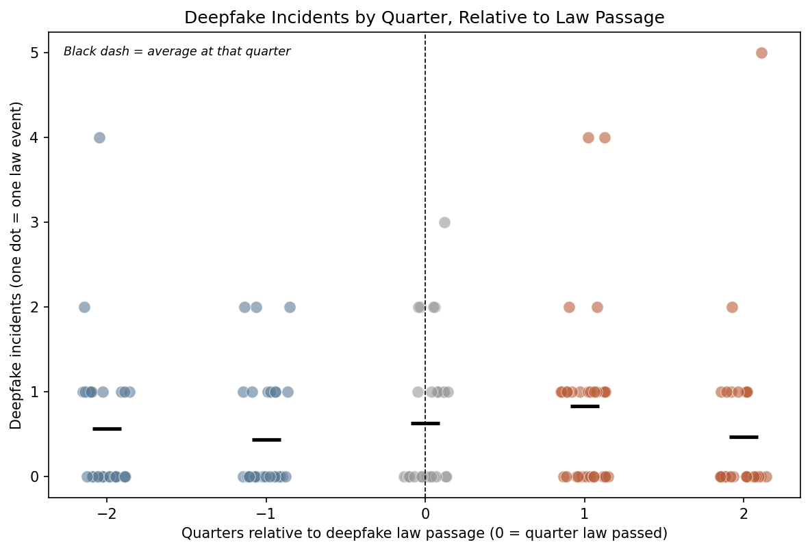
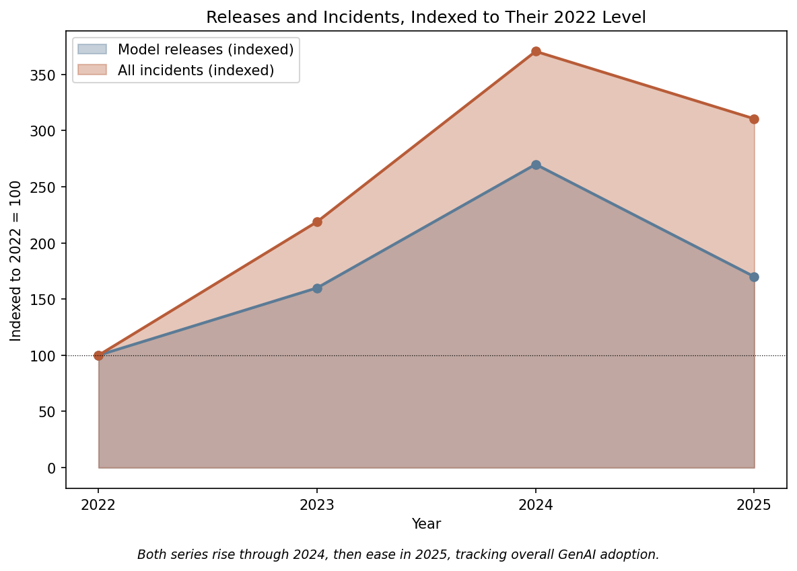
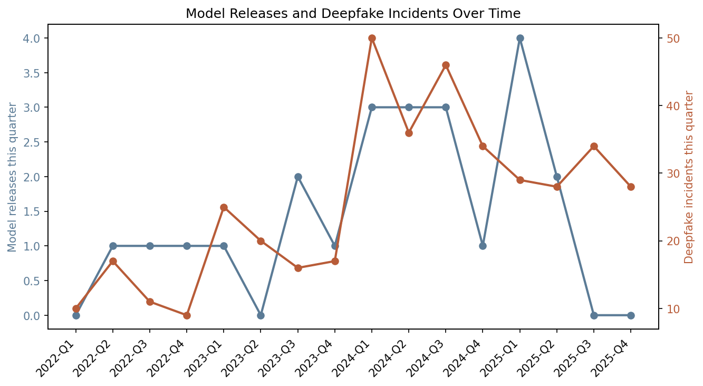
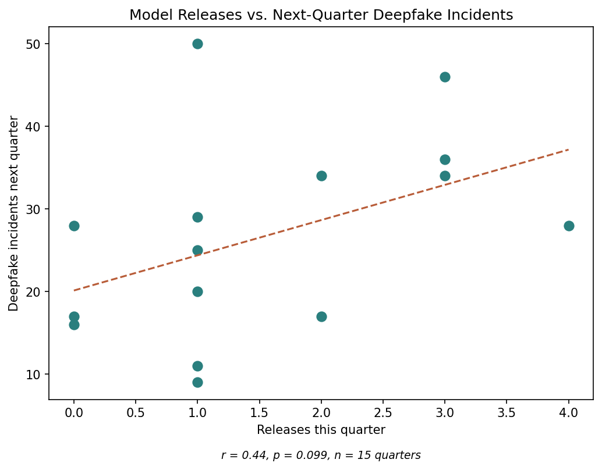
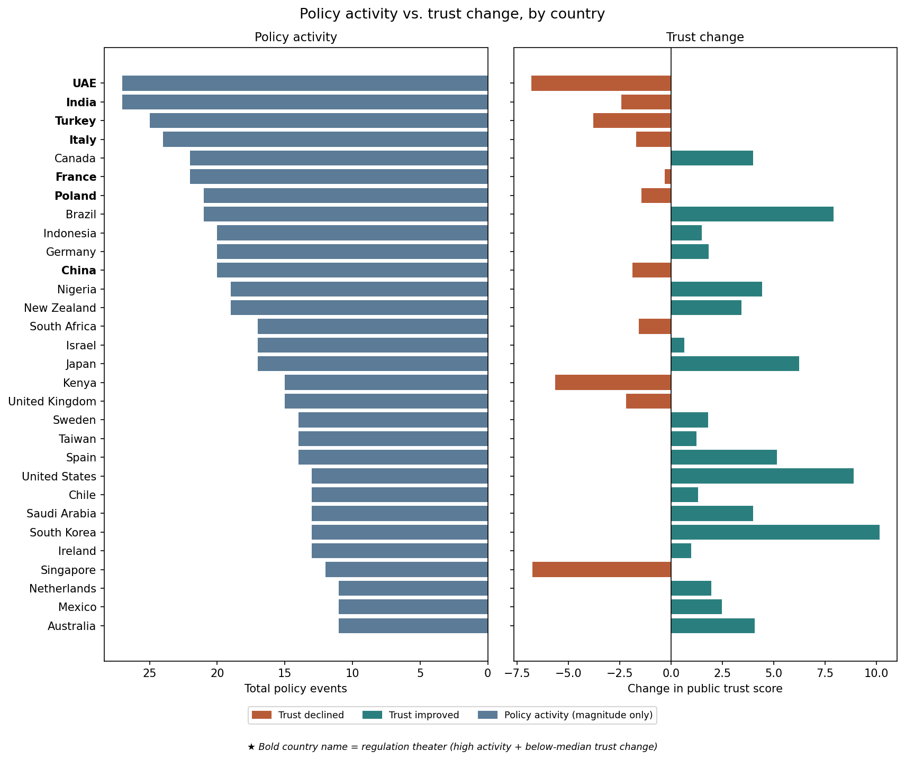
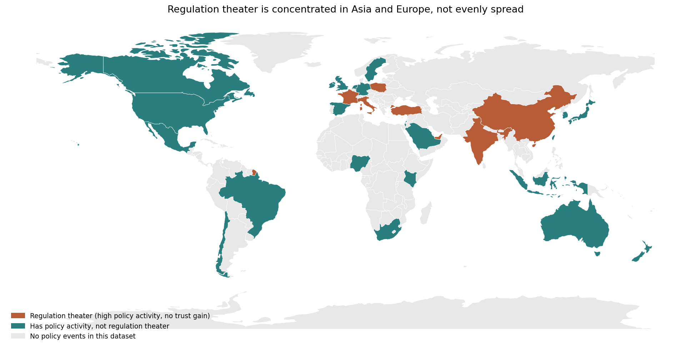

# AI Regulation Timing & Trust Analysis

A timing and correlation analysis asking the question AI governance debates usually skip past: does regulation actually change anything, or is a lot of it just activity without results?

Every year brings a new wave of AI laws, ethics boards, and regulatory frameworks, alongside a parallel wave of headlines about deepfakes, AI fraud, and algorithmic harm. The two are treated as connected, but rarely tested against each other directly. If policy isn't measurably reducing harm, that's not a footnote. It's the difference between governance that protects people and governance that just looks like it does.

## Why this project

This project uses five linked global datasets (2022-2025) to test policy against outcomes directly, rather than assuming a law "worked" because it passed. It's built around five questions, worked in this order:

1. **Does harm tend to happen before policy responds, or does policy ever get ahead of it?**
2. **Do specific policy events (deepfake laws specifically) produce a measurable before/after change in related incidents?**
3. **Does a wave of image/video-generation model releases predict a rise in deepfake-related incidents afterward?**
4. **Which countries show "regulation theater":** a lot of policy activity with no accompanying improvement in public trust?
5. **Does the same pattern hold for a completely different harm category** (algorithmic bias), using the closest available policy match in the data?

Every before/after comparison is backed by a paired significance test, not just two averages side by side. Question 1's finding is also normalized and checked across multiple window widths (a sensitivity check), and Question 3's correlation gets a p-value alongside the correlation coefficient, plus a check for a simpler shared-trend explanation.

## Data

[Global GenAI Adoption and Impact Index (2022-2025)](https://www.kaggle.com/datasets/aamir28/global-genai-adoption-and-impact-index-2022-2025): five linked tables.

| Table | Grain | Rows | Covers |
|---|---|---|---|
| `gaaii_country_year.csv` | country × year | 552 | Adoption, regulation stringency, harm indices, public trust |
| `gaaii_incidents.csv` | individual incident | 1,800 | Deepfakes, AI hiring bias, fraud, misinformation, with severity and sector |
| `gaaii_policy_events.csv` | individual policy event | 520 | Laws, bills, treaties, with lobbying/opposition scores |
| `gaaii_model_releases.csv` | individual model | 70 | 25 organizations, release dates, categories |
| `gaaii_survey_microdata.csv` | individual respondent | 22,989 | Public trust, fear of job loss, experienced harm (not used directly in these questions, but available for follow-up work) |

None of these tables share a single common key at the same grain: `incidents` and `policy_events` are event-level, `country_year` is annual, `model_releases` is global. Most of the analytical work in this project is building the connective tissue: rolling incidents up to country-quarter counts, converting dates into a comparable sortable timeline, and merging tables that don't naturally line up.

**One additional file**, `world.geojson`, is included in this repo (not part of the original Kaggle dataset). It provides country boundary shapes for the regulation-theater map and lets that chart run offline without depending on an external map service.

## Key findings

| Question | Finding |
|---|---|
| **Does harm precede policy?** | Incidents are significantly *higher* after a policy event than before (6.12 vs. 6.52, p = 0.047), the opposite of the hoped-for pattern. Normalized per quarter and checked across window widths (±1 to ±4 quarters), the gap only becomes significant past ±1 quarter and widens the further out you look: from nearly nothing at ±1 to 0.34 incidents per quarter at ±4. |
| **Do deepfake laws reduce deepfake incidents?** | No significant change overall (1.0 before vs. 1.3 after, p = 0.313, only 30 events). Breaking it out by actual quarter instead of two averages reveals a pattern the aggregate hides: 17 of 30 events show at least one incident the quarter right after a law passes, versus only 10 of 30 the quarter before, then it eases back by the second quarter after. |
| **Do model releases predict incident spikes?** | A moderate positive correlation (r = 0.44) between visual-generation model releases and next-quarter deepfake incidents, though the p-value (0.0995) just misses conventional significance with only 15 quarters of data. A broader check found total incidents and total model releases across *every* category share the same rise-through-2024-then-ease-in-2025 shape, tracking overall GenAI adoption growth. A shared adoption trend explains the correlation at least as well as a direct link would. |
| **"Regulation theater" countries** | Seven countries show high policy activity with declining public trust: India, UAE, Turkey, Italy, France, Poland, and China. UAE shows the steepest trust decline (-6.81 points) despite tying India for the most policy events (27 each). The pattern concentrates on two continents, Asia (4 countries) and Europe (3), with none in Africa, the Americas, or Oceania. |
| **Does this generalize to algorithmic bias?** | A different, if inconclusive, story: bias incidents (hiring plus credit scoring) actually go *down* after an Algorithmic Accountability Act (0.75 before vs. 0.46 after), though not significantly (p = 0.216, n = 24). Numerically the opposite direction from Questions 1 and 2, a reminder the "policy doesn't move outcomes" finding doesn't automatically generalize to every harm category. |

### What this means, in plain terms

- **The data doesn't support "regulation is working," and in one test it points the other way.** The broadest test (Question 1) found incidents significantly *higher* after a policy event, not lower, and that gap gets stronger the longer you look past the policy moment, not weaker. That's a real, measured pattern, not just an absence of good news.
- **Even where the aggregate looks flat, the actual timeline isn't.** Deepfake incidents don't move steadily around a deepfake law: they spike specifically in the quarter right after it passes, broadly across the events tested, then ease back. A two-number "before vs. after" comparison would have missed that shape entirely.
- **A likely, more charitable explanation: policy often follows harm, not the other way around.** Some of the "after" bump may really be the tail end of whatever prompted the policy in the first place. A country doesn't usually pass a deepfake law in a vacuum; it passes one after deepfakes become a visible problem. This project can't fully untangle that from a real backfire effect using before/after comparisons alone. That's exactly the kind of question the hiring-bias project's causal methods are built for, and this one isn't.
- **The releases-incidents correlation may just be two things riding the same wave.** Total incidents and total model releases both rose through 2024 and eased in 2025, tracking the same overall AI adoption growth. That doesn't disprove a direct link, but it means the data fits "both are swept up in a shared trend" just as well as "releases specifically cause incidents."
- **Not every harm category tells the same story.** Algorithmic bias incidents trended down (not significantly) after accountability acts, while deepfake incidents didn't move and overall incidents rose. Lumping "does regulation work" into one yes/no answer would hide that real variation.
- **"Regulation theater" is identifiable, not just a talking point.** Seven specific countries combine high policy output with falling public trust, and the group concentrates in Asia (4 countries) and Europe (3), with Asia actually contributing more countries than Europe. That's a concrete, nameable pattern a Trust & Safety or governance team could act on, worth stating with continent-level framing rather than World Bank region categories, which tend to center Europe and North America as the implicit reference point.
- **The honest bottom line:** in this dataset, passing more AI laws isn't reliably associated with less harm or more trust in the short term. In the broadest test, it's associated with slightly more of both problems, not fewer. That's an uncomfortable finding worth stating plainly rather than softening.

## What the analysis looks like

**Incidents Before and After**, normalized per quarter so the comparison across window widths is fair: the gap widens the further out you look, and only becomes statistically significant past a ±1 quarter window.

**Is the +1 quarter spike after a deepfake law broad-based, or driven by a couple of outliers?** Plotting every individual event instead of just the average answers that directly: 17 of 30 law events show at least one incident the quarter after passage, versus 10 of 30 the quarter before. Two events reach the high end and add extra lift, but the pattern holds even without them.

*How to read the x-axis:* the numbers aren't a count going negative, they're a position in time relative to when each law passed. Every one of the 30 deepfake laws passed in a different real calendar quarter, so "0" is redefined as *that law's own passage quarter* for each one, letting all 30 line up on the same scale. "-2" means two quarters before a law passed, "+1" means one quarter after, the same idea as "T-minus 2" or "T-plus 1" in a countdown. The dashed line at 0 marks the moment each law passed.

**Do model releases predict next-quarter incidents, or are both just riding the same wave?** Total model releases and total incidents (every category, not just visual-gen or deepfake) trace the same shape over 2022-2025: a steady climb through 2024, then a pullback in 2025.

*What "indexed" means:* releases and incidents happen on wildly different scales (tens of releases a year vs. hundreds of incidents), so plotted directly, one line would flatten to nearly nothing next to the other. Indexing rescales each series so its own 2022 value becomes 100, and every later year is shown as a percentage of that starting point, the same technique behind a stock market index. 2022 isn't a claim that anything "began" that year, it's just the earliest year in the dataset and the fixed reference point both series are measured against.

The same co-movement shows up at the quarter level for the narrower visual-gen and deepfake series specifically.

The scatter plot is the actual correlation test behind that impression: r = 0.44, p = 0.099, not quite clearing conventional significance with only 15 quarters of data.

**Which countries show regulation theater?** Color always means the sign of the trust-change bar itself (decline vs. improvement). Bolded country names carry the separate "regulation theater" classification (high activity plus below-median trust), so a country can show declining trust without qualifying as regulation theater if its policy activity isn't also above the median. Kenya, the UK, and Singapore are a good example of that distinction.

**Where in the world does regulation theater concentrate?** Laid out geographically, it's visibly concentrated in Asia and Europe specifically, with no regulation-theater countries in Africa, the Americas, or Oceania.

## Tools

- **pandas**: multi-table merging, groupby rollups, custom time-window logic for the before/after comparisons, and the quarter-arithmetic groundwork that makes the timing questions possible in the first place
- **matplotlib**: visualization
- **numpy**: the trend line fit on the correlation scatter and jitter on the strip plot
- **scipy**: paired significance testing (`ttest_rel`) for every before/after comparison, and correlation significance (`pearsonr`) for Question 3
- **geopandas**: reading country boundary shapes and building the regulation-theater map
- **country_converter**: mapping country names to continent and ISO3 codes

## Author

Keshia Neal, Ph.D.
